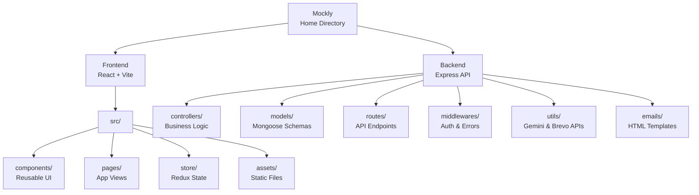

# Project Structure & Quick Reference Guide

## Project Directory Tree - CORE Structure

---

## Detailed Directory Breakdown

### 1. Frontend Directory (`/Frontend/src`)

#### `/components` - Reusable UI Components
- `Header.jsx`: Main navigation bar
- `Footer.jsx`: Application footer
- `ProtectedRoute.jsx`: Route wrapper for authentication
- `ProfileForm.jsx`: User profile editing form
- `UserProfileCard.jsx`: Reusable card for profile data
- `InterviewHistory.jsx`: List component for past interviews
- `OTPInput.jsx`: Verification code input component

#### `/pages` - Application Views
- `Home.jsx`: Landing page
- `Login.jsx`: User authentication
- `Register.jsx`: Account creation
- `OTPVerification.jsx`: Email verification step
- `Dashboard.jsx`: Main user overview
- `Interview.jsx`: Interview setup (topic selection)
- `InterviewSession.jsx`: Active interview interface (includes Web Speech API logic)
- `InterviewResults.jsx`: Post-interview evaluation view
- `UserProfile.jsx`: Logged-in user's private profile
- `ViewProfile.jsx`: Publicly accessible user profile

#### `/store` - Redux State Management
- `index.js`: Store configuration and persistence setup
- `/slices/authSlice.js`: Authentication state
- `/slices/interviewSlice.js`: Interview session state
- `/slices/dashboardSlice.js`: Dashboard analytics state
- `/slices/profileSlice.js`: User profile data state

#### Root Frontend Files
- `server.js`: Reads Vite environment variables for backend URL
- `App.jsx`: Main routing configuration
- `Layout.jsx`: Wrapper for Header, Footer, and page content

---

### 2. Backend Directory (`/Backend`)

#### `/controllers` - Route Handlers & Business Logic
- `user.controller.js`: Registration, login, profile management
- `interview.controller.js`: Starting sessions (calls Gemini API), evaluating answers, enforcing daily limits
- `dashboard.controller.js`: Aggregating analytics for the dashboard

#### `/models` - MongoDB Schemas
- `User.model.js`: User schema (credentials, profile data)
- `Interview.model.js`: Interview session schema (questions, score, status)

#### `/routes` - API Route Definitions
- `user.routes.js`: Maps `/api/v1/user` endpoints
- `interview.routes.js`: Maps `/api/v1/interview` endpoints
- `dashboard.routes.js`: Maps `/api/v1/dashboard` endpoints

#### `/middlewares` - Request Interceptors
- `auth.js`: Verifies JWT tokens and extracts user ID
- `error.js`: Global error handling middleware

#### `/utils` - Helper Functions & External API Clients
- `gemini.js`: Interfaces with Google Gemini API for question generation and evaluation
- `sendEmail.js`: Interfaces with Brevo REST API for transactional emails
- `jwt.js`: Token creation utilities
- `ErrorHandler.js`: Custom error class

#### `/emails` - Email Templates
- `emailTemplates.js`: HTML templates for OTP and notifications

#### Root Backend Files
- `app.js`: Express configuration and middleware setup
- `index.js`: Server entry point and database connection initialization

---

## Data Flow Examples

### 1. Starting an Interview Flow
1. **Frontend**: User selects topic/difficulty in `Interview.jsx` and clicks start.
2. **Backend Route**: Request hits `POST /api/v1/interview/start`.
3. **Controller**: `interview.controller.js` checks daily limit (3 max).
4. **Utility**: `gemini.js` is called to generate 8 questions via AI.
5. **Database**: New Interview document created in MongoDB.
6. **Frontend**: User redirected to `InterviewSession.jsx` to begin answering.

### 2. User Profile Fetch Flow
1. **Frontend**: `UserProfile.jsx` mounts and dispatches `getMyProfile`.
2. **Backend Route**: Request hits `GET /api/v1/user/my-profile`.
3. **Middleware**: `auth.js` verifies JWT and attaches `req.user._id`.
4. **Controller**: `user.controller.js` fetches User document and associated Interview documents.
5. **Frontend**: Redux store updates, populating performance charts and stats.
