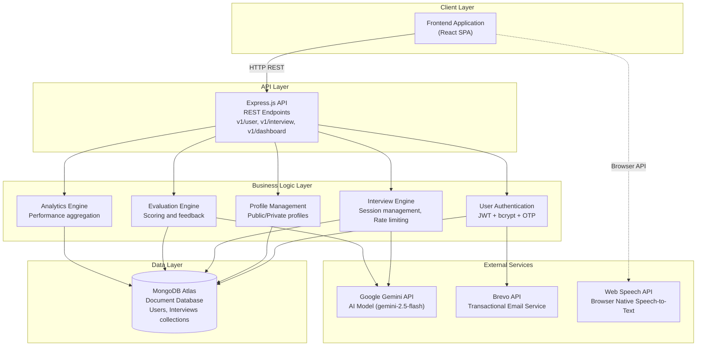
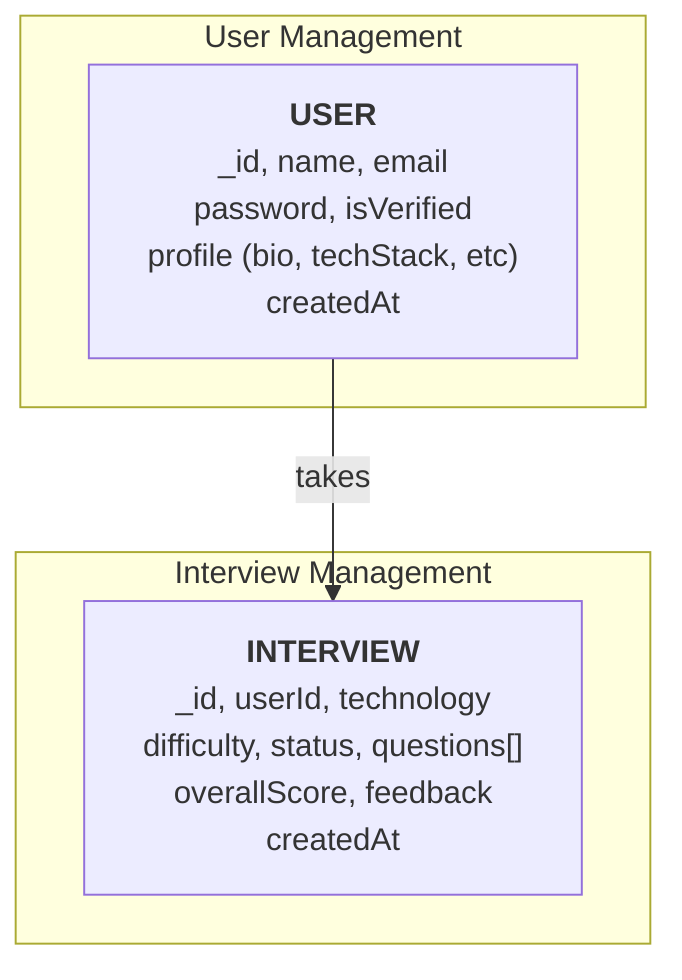
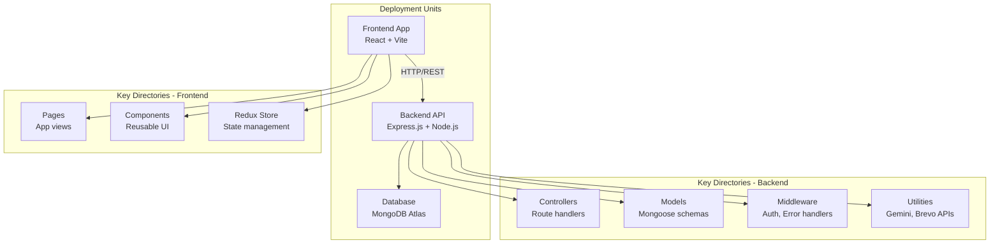

# Mockly - Complete Case Study
## AI-Powered Technical Interview Platform

---

## Executive Summary

**Mockly** is a comprehensive, production-grade AI-powered mock interview platform built with modern full-stack JavaScript technologies. The platform seamlessly helps developers practice technical interviews by leveraging advanced AI to generate context-aware questions, evaluate answers, and provide actionable feedback.

### Key Value Propositions:
- **Intelligent Assessment**: Utilizes Google Gemini AI to generate tailored questions and evaluate responses with detailed feedback.
- **Voice-Enabled Interface**: Integrates native Web Speech API for real-time speech-to-text, simulating a natural conversational interview environment.
- **Comprehensive Analytics**: Tracks performance over time with visual data representation and detailed history logs.
- **Robust Security and Abuse Prevention**: Implements JWT authentication, OTP verification via Brevo, and rate-limiting to prevent API abuse.

---

## Project Goals & Objectives

### Primary Objectives
1. **Simulate Real Interviews**: Build a platform that closely mimics technical interviews using AI-generated questions and voice-to-text input.
2. **Deliver Actionable Feedback**: Provide users with immediate, AI-driven evaluation, including a score and constructive feedback.
3. **Ensure Platform Sustainability**: Implement rate limits (3 interviews per day) to manage API token consumption and prevent abuse.
4. **Provide Secure Authentication**: Use OTP email verification and JWTs for secure user registration and session management.
5. **Track User Progress**: Create comprehensive dashboards and profile pages to visualize performance trends over time.

### Secondary Objectives
- Allow users to enter custom interview topics beyond predefined categories.
- Ensure a responsive, accessible, and modern user interface using React and Tailwind CSS.
- Maintain public profiles so users can share their interview performance.

---

## System Architecture

### High-Level System Architecture



---

## Database Design Architecture

### Database Schema Relationships



### Key Collections

| Collection | Purpose | Key Fields |
|-----------|---------|-----------|
| **Users** | Account authentication and profile data | name, email, password, isVerified, profile object |
| **Interviews**| Interview session tracking and AI evaluations | userId, technology, difficulty, questions array, status, overallScore, feedback |

---

## Application Flow Diagrams

### User Authentication & Onboarding


### Interview Session Flow


---

## Project Structure Overview

The project is organized into two main deployment units:



**For detailed directory structure and file descriptions, refer to PROJECT_STRUCTURE.md**

---

## Core Features & Capabilities

### AI-Powered Interview Engine
- **Question Generation**: Uses Google Gemini (gemini-2.5-flash) to generate 8 contextual questions based on technology and difficulty.
- **Custom Topics**: Users can input custom technologies or frameworks for niche interview practice.
- **Automated Evaluation**: AI grades the entire session, providing a score out of 10 and constructive feedback.

### Voice-Enabled Input
- **Speech-to-Text**: Integrates the native Web Speech API allowing users to dictate answers in real-time.
- **Visual Feedback**: Pulsing recording indicators and graceful fallbacks for unsupported browsers.

### Profile & Analytics
- **Public & Private Profiles**: Users can view their own analytics or share their public profile link.
- **Performance Charts**: Visualizes score trends across past interviews using Recharts.
- **History Tracking**: Keeps a detailed log of all past interviews, technologies, and difficulties.

### Security & Rate Limiting
- **Daily Caps**: Hard limit of 3 interviews per user per day to manage AI token consumption.
- **Secure Authentication**: JWT-based session management and bcrypt password hashing.
- **OTP Verification**: Email verification flow using the Brevo REST API.

---

## Technology Stack

### Frontend Technologies
| Layer | Technology | Purpose |
|-------|-----------|---------|
| **Framework** | React 19.x | UI library for dynamic interfaces |
| **Build Tool** | Vite 7.x | Fast module bundler and dev server |
| **Styling** | Tailwind CSS 3.4 | Utility-first CSS framework |
| **State Management** | Redux Toolkit | Predictable state container |
| **HTTP Client** | Axios | Promise-based HTTP client |
| **Routing** | React Router 7.x | Client-side routing solution |
| **Charts** | Recharts | Composable charting library |
| **Icons** | React Icons | SVG icon library |

### Backend Technologies
| Layer | Technology | Purpose |
|-------|-----------|---------|
| **Runtime** | Node.js | JavaScript server runtime |
| **Framework** | Express.js 5.x | Web application framework |
| **Database** | MongoDB 5.0+ | NoSQL document database |
| **ODM** | Mongoose 8.x | MongoDB object modeling |
| **Authentication** | JWT 9.0 | JSON Web Token implementation |
| **Password Security** | bcrypt 6.0 | Password hashing library |
| **AI Integration** | @google/generative-ai | Google Gemini API client |
| **Email Service** | Brevo REST API | Transactional email delivery |
| **CORS** | CORS 2.8 | Cross-Origin Resource Sharing |
| **Environment** | dotenv 17.2 | Environment variable management |

### Infrastructure & External Services
| Service | Purpose | Details |
|---------|---------|---------|
| **MongoDB Atlas** | Database hosting | Cloud NoSQL database |
| **Google AI Studio**| AI API | Gemini-2.5-flash model |
| **Brevo** | Email API | OTP and notification delivery |

---

## API Documentation Overview

The backend exposes a RESTful API organized into main route modules:

### API Routes Structure

```
/api/v1/
├── /user           → Authentication, registration, profile management
├── /interview      → Starting sessions, submitting answers, history
└── /dashboard      → Analytical endpoints for user dashboard
```

### Key API Endpoints (Examples)

#### Authentication & User
```
POST   /api/v1/user/register          → Create user account and trigger OTP
POST   /api/v1/user/verify            → Verify email with OTP
POST   /api/v1/user/login             → Authenticate user
GET    /api/v1/user/my-profile        → Fetch logged-in user profile
PUT    /api/v1/user/profile           → Update profile data
```

#### Interview
```
POST   /api/v1/interview/start        → Initialize 8-question interview session
POST   /api/v1/interview/submit/:id   → Submit answer for current question
GET    /api/v1/interview/results/:id  → Retrieve evaluation results
GET    /api/v1/interview/history      → List all completed interviews
GET    /api/v1/interview/analytics    → Get aggregate performance data
```

---

## Known Issues & Recommendations

### Recommendations for Future Development
1. **Audio Recording**: Store actual audio clips of user responses for playback and review.
2. **Real-time AI Voice**: Implement Text-to-Speech (TTS) so the AI "speaks" the question aloud.
3. **Advanced Analytics**: Break down scoring by soft skills, technical accuracy, and clarity.
4. **OAuth Integration**: Add Google/GitHub single sign-on (SSO) for faster onboarding.
5. **Caching**: Implement Redis to cache public profile data and reduce database load.

---

## Development Team

**Architecture**: Full-stack JavaScript (MERN stack)  
**Last Updated**: September 2026

---

## Support & Documentation

For questions about specific components or implementation details:
- **Project Structure**: See PROJECT_STRUCTURE.md
- **Architecture Details**: Review system diagrams above
