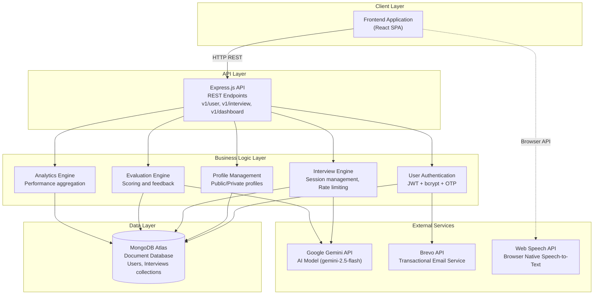
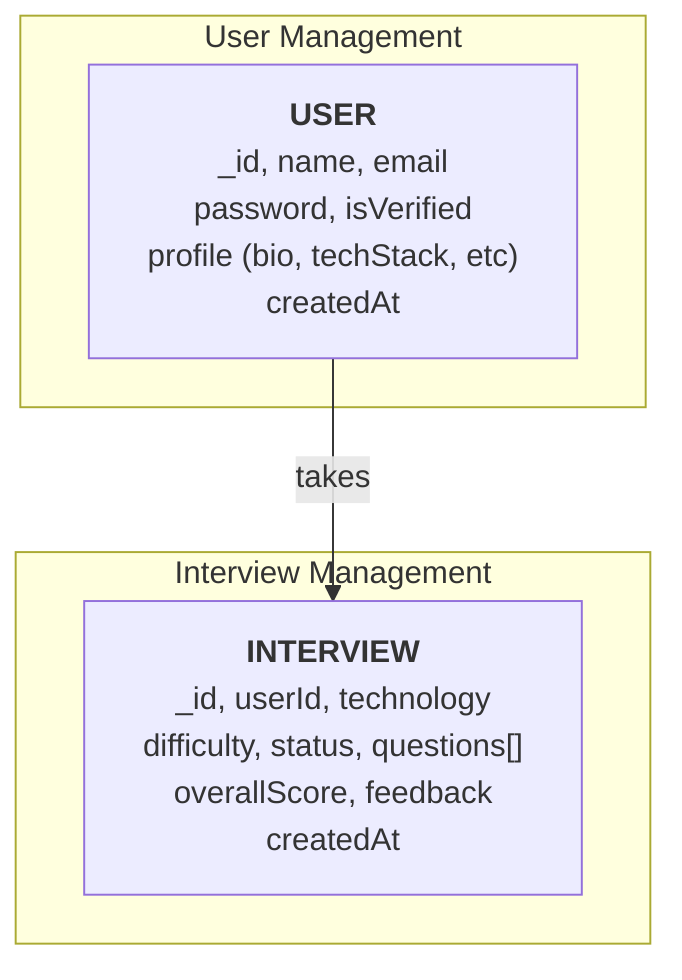
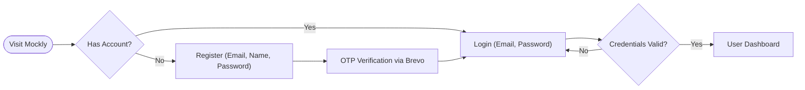
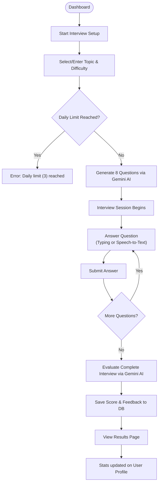
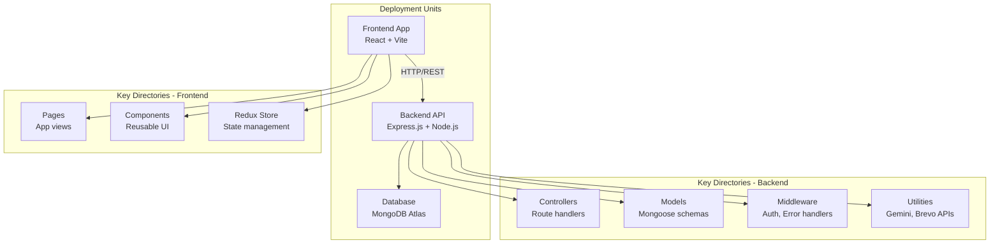

<<<<<<< HEAD
# Mockly - Complete Case Study
## AI-Powered Technical Interview Platform
=======
# Mockly 🎯

A full-stack AI-powered mock interview platform that helps developers practice technical interviews. The application uses Google Gemini AI to generate interview questions and provide intelligent feedback on candidate responses.

## ✨ Features

- **User Authentication**: Secure registration and login with OTP email verification
- **AI-Powered Interviews**: Generate interview questions using Google Gemini AI based on technology and difficulty level
- **Real-time Interview Sessions**: Interactive interview interface with question-by-question progression
- **AI Evaluation**: Automated scoring and detailed feedback on interview performance
- **Interview History**: Track and review all past interview sessions
- **User Profiles**: Manage and view user profiles with interview statistics
- **Dashboard**: Comprehensive overview of interview performance and statistics
- **Email Notifications**: OTP verification and interview updates via email

## 🛠️ Tech Stack

### Backend
- **Runtime**: Node.js
- **Framework**: Express.js
- **Database**: MongoDB with Mongoose
- **AI Integration**: Google Gemini AI (gemini-2.5-flash)
- **Authentication**: JWT (JSON Web Tokens) with cookie-based sessions
- **Email Service**: Nodemailer
- **Security**: bcrypt for password hashing

### Frontend
- **Framework**: React 19
- **Build Tool**: Vite
- **Styling**: Tailwind CSS
- **State Management**: Redux Toolkit with Redux Persist
- **Routing**: React Router DOM v7
- **HTTP Client**: Axios
- **Icons**: React Icons

## 📋 Prerequisites

Before you begin, ensure you have the following installed:
- **Node.js** (v18 or higher)
- **npm** or **yarn**
- **MongoDB** (local instance or MongoDB Atlas account)
- **Google Gemini API Key** (from [Google AI Studio](https://makersuite.google.com/app/apikey))

## 🚀 Installation

### 1. Clone the repository
```bash
git clone <repository-url>
cd interviewPrep
```

### 2. Backend Setup

```bash
cd Backend
npm install
```

Create a `.env` file in the `Backend` directory:
```env
PORT=5000
MONGODB_URL=your_mongodb_connection_string
GEMINI_API_KEY=your_google_gemini_api_key
JWT_SECRET=your_jwt_secret_key
JWT_REFRESH_SECRET=your_jwt_refresh_secret_key
EMAIL_HOST=smtp.gmail.com
EMAIL_PORT=587
EMAIL_USER=your_email@gmail.com
EMAIL_PASS=your_app_specific_password
FRONTEND_URL=http://localhost:5173
```

### 3. Frontend Setup

```bash
cd Frontend
npm install
```

Create a `.env` file in the `Frontend` directory (if needed):
```env
VITE_API_URL=http://localhost:5000/api/v1
```

## 🏃 Running the Application

### Development Mode

**Backend:**
```bash
cd Backend
npm run dev
```
The backend server will start on `http://localhost:5000`

**Frontend:**
```bash
cd Frontend
npm run dev
```
The frontend will start on `http://localhost:5173`

### Production Mode

**Backend:**
```bash
cd Backend
npm start
```

**Frontend:**
```bash
cd Frontend
npm run build
npm run preview
```

## 📁 Project Structure

```
interviewPrep/
├── Backend/
│   ├── app.js                 # Express app configuration
│   ├── index.js               # Server entry point
│   ├── package.json
│   ├── config/
│   │   └── db.js              # MongoDB connection
│   ├── controllers/
│   │   ├── user.controller.js
│   │   ├── interview.controller.js
│   │   └── dashboard.controller.js
│   ├── middelwares/
│   │   └── auth.js            # JWT authentication middleware
│   ├── models/
│   │   ├── User.model.js
│   │   └── Interview.model.js
│   ├── routes/
│   │   ├── user.routes.js
│   │   ├── interview.routes.js
│   │   └── dashboard.routes.js
│   └── utils/
│       ├── gemini.js          # Google Gemini AI integration
│       └── sendEmail.js       # Email service
│
└── Frontend/
    ├── index.html
    ├── package.json
    ├── vite.config.js
    ├── tailwind.config.js
    ├── public/
    └── src/
        ├── App.jsx             # Main app component with routing
        ├── main.jsx            # React entry point
        ├── Layout.jsx          # Layout wrapper
        ├── components/
        │   ├── Header.jsx
        │   ├── Footer.jsx
        │   ├── ProtectedRoute.jsx
        │   ├── ProfileForm.jsx
        │   ├── UserProfileCard.jsx
        │   ├── InterviewHistory.jsx
        │   └── OTPInput.jsx
        ├── pages/
        │   ├── Home.jsx
        │   ├── Login.jsx
        │   ├── Register.jsx
        │   ├── OTPVerification.jsx
        │   ├── Dashboard.jsx
        │   ├── Interview.jsx
        │   ├── InterviewSession.jsx
        │   ├── InterviewResults.jsx
        │   ├── UserProfile.jsx
        │   └── ViewProfile.jsx
        └── store/
            ├── index.js        # Redux store configuration
            └── slices/
                ├── authSlice.js
                ├── interviewSlice.js
                ├── dashboardSlice.js
                └── profileSlice.js
```

## 🔌 API Endpoints

### User Routes (`/api/v1/user`)
- `POST /register` - Register a new user
- `POST /verify` - Verify email with OTP
- `POST /login` - User login
- `GET /logout` - User logout
- `POST /resend` - Resend OTP
- `GET /my-profile` - Get logged-in user's profile (Protected)
- `PUT /profile` - Update user profile (Protected)
- `GET /profile/:userId` - Get specific user's public profile

### Interview Routes (`/api/v1/interview`)
- `POST /start` - Start a new interview session (Protected)
- `POST /submit/:id` - Submit answer for a question (Protected)
- `GET /results/:interviewId` - Get interview results (Protected)
- `GET /history` - Get user's interview history (Protected)

### Dashboard Routes (`/api/v1/dashboard`)
- Various dashboard statistics endpoints (Protected)

## 🎯 Key Features Explained

### AI-Powered Question Generation
The application uses Google Gemini AI to generate contextual interview questions based on:
- **Technology**: e.g., JavaScript, Python, React, Node.js
- **Difficulty Level**: Beginner, Intermediate, Advanced

### Interview Evaluation
After completing an interview, the AI evaluates:
- Overall score (out of 10)
- Detailed feedback on strengths and areas for improvement
- Performance analysis based on difficulty level

### Authentication Flow
1. User registers with email
2. OTP sent to email for verification
3. After verification, user can login
4. JWT tokens stored in HTTP-only cookies for security

## 🔒 Security Features

- Password hashing with bcrypt
- JWT-based authentication
- HTTP-only cookies for token storage
- Protected routes on both frontend and backend
- CORS configuration for secure cross-origin requests

## 📝 Environment Variables

### Backend `.env`
| Variable | Description |
|----------|-------------|
| `PORT` | Server port (default: 5000) |
| `MONGODB_URL` | MongoDB connection string |
| `GEMINI_API_KEY` | Google Gemini API key |
| `JWT_SECRET` | Secret for JWT token signing |
| `JWT_REFRESH_SECRET` | Secret for refresh token signing |
| `EMAIL_HOST` | SMTP server host |
| `EMAIL_PORT` | SMTP server port |
| `EMAIL_USER` | Email address for sending emails |
| `EMAIL_PASS` | App-specific password for email |
| `FRONTEND_URL` | Frontend application URL |

## 🧪 Development

### Available Scripts

**Backend:**
- `npm start` - Start production server
- `npm run dev` - Start development server with nodemon

**Frontend:**
- `npm run dev` - Start development server
- `npm run build` - Build for production
- `npm run preview` - Preview production build
- `npm run lint` - Run ESLint

## 🤝 Contributing

Contributions are welcome! Please follow these steps:

1. Fork the repository
2. Create a feature branch (`git checkout -b feature/AmazingFeature`)
3. Commit your changes (`git commit -m 'Add some AmazingFeature'`)
4. Push to the branch (`git push origin feature/AmazingFeature`)
5. Open a Pull Request

## 📄 License

This project is licensed under the MIT License.

## 🙏 Acknowledgments

- Google Gemini AI for interview question generation and evaluation
- React and Vite communities for excellent tooling
- Express.js and MongoDB for robust backend infrastructure
>>>>>>> 717e8e36a73d3a35306c65bcdb59568d2e0bb4aa

---

## Executive Summary

**Mockly** is a comprehensive, production-grade AI-powered mock interview platform built with modern full-stack JavaScript technologies. The platform seamlessly helps developers practice technical interviews by leveraging advanced AI to generate context-aware questions, evaluate answers, and provide actionable feedback.

### Key Value Propositions:
- **Intelligent Assessment**: Utilizes Google Gemini AI to generate tailored questions and evaluate responses with detailed feedback.
- **Voice-Enabled Interface**: Integrates native Web Speech API for real-time speech-to-text, simulating a natural conversational interview environment.
- **Comprehensive Analytics**: Tracks performance over time with visual data representation and detailed history logs.
- **Robust Security and Abuse Prevention**: Implements JWT authentication, OTP verification via Brevo, and rate-limiting to prevent API abuse.

---

## Project Goals & Objectives

### Primary Objectives
1. **Simulate Real Interviews**: Build a platform that closely mimics technical interviews using AI-generated questions and voice-to-text input.
2. **Deliver Actionable Feedback**: Provide users with immediate, AI-driven evaluation, including a score and constructive feedback.
3. **Ensure Platform Sustainability**: Implement rate limits (3 interviews per day) to manage API token consumption and prevent abuse.
4. **Provide Secure Authentication**: Use OTP email verification and JWTs for secure user registration and session management.
5. **Track User Progress**: Create comprehensive dashboards and profile pages to visualize performance trends over time.

### Secondary Objectives
- Allow users to enter custom interview topics beyond predefined categories.
- Ensure a responsive, accessible, and modern user interface using React and Tailwind CSS.
- Maintain public profiles so users can share their interview performance.

---

## System Architecture

### High-Level System Architecture



---

## Database Design Architecture

### Database Schema Relationships



### Key Collections

| Collection | Purpose | Key Fields |
|-----------|---------|-----------|
| **Users** | Account authentication and profile data | name, email, password, isVerified, profile object |
| **Interviews**| Interview session tracking and AI evaluations | userId, technology, difficulty, questions array, status, overallScore, feedback |

---

## Application Flow Diagrams

### User Authentication & Onboarding



### Interview Session Flow



---

## Project Structure Overview

The project is organized into two main deployment units:



**For detailed directory structure and file descriptions, refer to PROJECT_STRUCTURE.md**

---

## Core Features & Capabilities

### AI-Powered Interview Engine
- **Question Generation**: Uses Google Gemini (gemini-2.5-flash) to generate 8 contextual questions based on technology and difficulty.
- **Custom Topics**: Users can input custom technologies or frameworks for niche interview practice.
- **Automated Evaluation**: AI grades the entire session, providing a score out of 10 and constructive feedback.

### Voice-Enabled Input
- **Speech-to-Text**: Integrates the native Web Speech API allowing users to dictate answers in real-time.
- **Visual Feedback**: Pulsing recording indicators and graceful fallbacks for unsupported browsers.

### Profile & Analytics
- **Public & Private Profiles**: Users can view their own analytics or share their public profile link.
- **Performance Charts**: Visualizes score trends across past interviews using Recharts.
- **History Tracking**: Keeps a detailed log of all past interviews, technologies, and difficulties.

### Security & Rate Limiting
- **Daily Caps**: Hard limit of 3 interviews per user per day to manage AI token consumption.
- **Secure Authentication**: JWT-based session management and bcrypt password hashing.
- **OTP Verification**: Email verification flow using the Brevo REST API.

---

## Technology Stack

### Frontend Technologies
| Layer | Technology | Purpose |
|-------|-----------|---------|
| **Framework** | React 19.x | UI library for dynamic interfaces |
| **Build Tool** | Vite 7.x | Fast module bundler and dev server |
| **Styling** | Tailwind CSS 3.4 | Utility-first CSS framework |
| **State Management** | Redux Toolkit | Predictable state container |
| **HTTP Client** | Axios | Promise-based HTTP client |
| **Routing** | React Router 7.x | Client-side routing solution |
| **Charts** | Recharts | Composable charting library |
| **Icons** | React Icons | SVG icon library |

### Backend Technologies
| Layer | Technology | Purpose |
|-------|-----------|---------|
| **Runtime** | Node.js | JavaScript server runtime |
| **Framework** | Express.js 5.x | Web application framework |
| **Database** | MongoDB 5.0+ | NoSQL document database |
| **ODM** | Mongoose 8.x | MongoDB object modeling |
| **Authentication** | JWT 9.0 | JSON Web Token implementation |
| **Password Security** | bcrypt 6.0 | Password hashing library |
| **AI Integration** | @google/generative-ai | Google Gemini API client |
| **Email Service** | Brevo REST API | Transactional email delivery |
| **CORS** | CORS 2.8 | Cross-Origin Resource Sharing |
| **Environment** | dotenv 17.2 | Environment variable management |

### Infrastructure & External Services
| Service | Purpose | Details |
|---------|---------|---------|
| **MongoDB Atlas** | Database hosting | Cloud NoSQL database |
| **Google AI Studio**| AI API | Gemini-2.5-flash model |
| **Brevo** | Email API | OTP and notification delivery |

---

## API Documentation Overview

The backend exposes a RESTful API organized into main route modules:

### API Routes Structure

```
/api/v1/
├── /user           → Authentication, registration, profile management
├── /interview      → Starting sessions, submitting answers, history
└── /dashboard      → Analytical endpoints for user dashboard
```

### Key API Endpoints (Examples)

#### Authentication & User
```
POST   /api/v1/user/register          → Create user account and trigger OTP
POST   /api/v1/user/verify            → Verify email with OTP
POST   /api/v1/user/login             → Authenticate user
GET    /api/v1/user/my-profile        → Fetch logged-in user profile
PUT    /api/v1/user/profile           → Update profile data
```

#### Interview
```
POST   /api/v1/interview/start        → Initialize 8-question interview session
POST   /api/v1/interview/submit/:id   → Submit answer for current question
GET    /api/v1/interview/results/:id  → Retrieve evaluation results
GET    /api/v1/interview/history      → List all completed interviews
GET    /api/v1/interview/analytics    → Get aggregate performance data
```

---

## Known Issues & Recommendations

### Recommendations for Future Development
1. **Audio Recording**: Store actual audio clips of user responses for playback and review.
2. **Real-time AI Voice**: Implement Text-to-Speech (TTS) so the AI "speaks" the question aloud.
3. **Advanced Analytics**: Break down scoring by soft skills, technical accuracy, and clarity.
4. **OAuth Integration**: Add Google/GitHub single sign-on (SSO) for faster onboarding.
5. **Caching**: Implement Redis to cache public profile data and reduce database load.

---

## Development Team

**Architecture**: Full-stack JavaScript (MERN stack)  
**Last Updated**: September 2026

---

## Support & Documentation

For questions about specific components or implementation details:
- **Project Structure**: See PROJECT_STRUCTURE.md
- **Architecture Details**: Review system diagrams above
